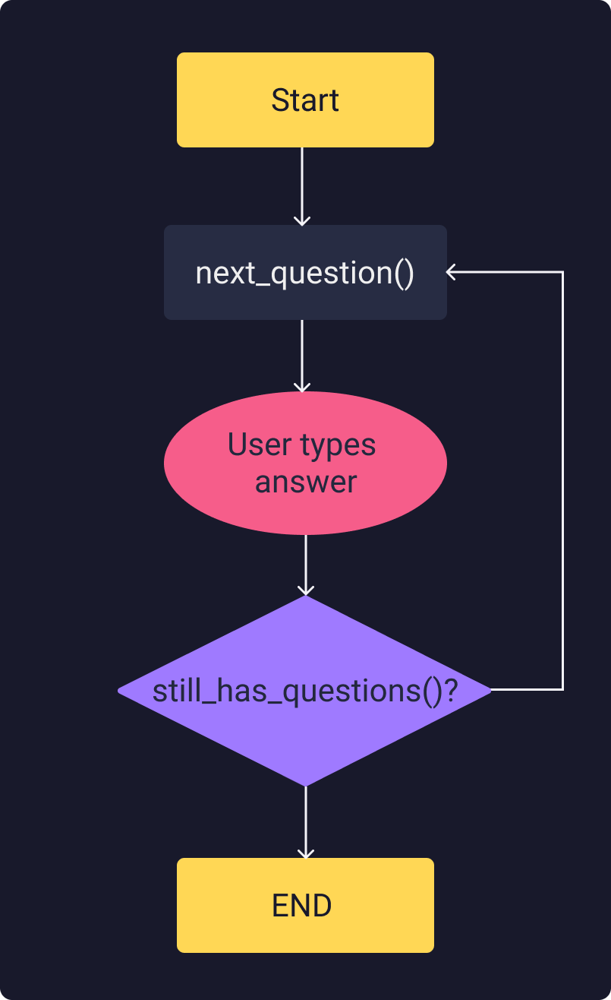

# Python Quiz App 🐍✨
### Just a project created in order to practice OOP in Python
# Flow

# Objects
* Question
  * **attributes**
    * text
    * answer
* QuizBrain
  * **attributes**
    * question_number = 0
    * questions_list
  * **methods**
    * next_question() 
# To do
- [X] Create a question bank according to the data on data.py
- [ ] Asking the questions
- [ ] Checking if the answer was correct
- [ ] Checking if we're the end of the quiz